# 🎨 YouTube Downloader & Player - Design Documentation

This document provides comprehensive design documentation for the YouTube Playlist Downloader & Player web application.

## Table of Contents

1. [High-Level Design (HLD)](#high-level-design-hld)
2. [Low-Level Design (LLD)](#low-level-design-lld)
3. [Sequence Diagrams](#sequence-diagrams)
4. [Data Flow](#data-flow)
5. [Component Architecture](#component-architecture)

---

## High-Level Design (HLD)

### System Architecture Overview

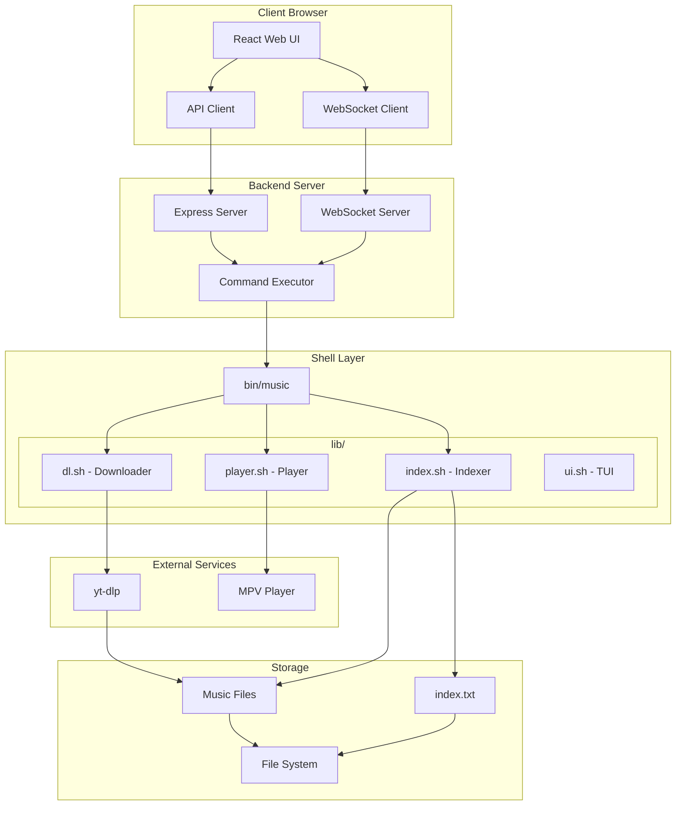
```mermaid
graph TB
    subgraph "Client Browser"
        UI[React Web UI]
        WS_CLIENT[WebSocket Client]
        API_CLIENT[API Client]
    end

    subgraph "Backend Server"
        EXPRESS[Express Server]
        WS_SERVER[WebSocket Server]
        EXECUTOR[Command Executor]
    end

    subgraph "Shell Layer"
        MUSIC_BIN[bin/music]
        subgraph "lib/"
            DL[dl.sh - Downloader]
            PLAYER[player.sh - Player]
            INDEX[index.sh - Indexer]
            UI_LIB[ui.sh - TUI]
        end
    end

    subgraph "External Services"
        YT_DLP[yt-dlp]
        MPV[MPV Player]
    end

    subgraph "Storage"
        FS[File System]
        INDEX_FILE[index.txt]
        MUSIC[Music Files]
    end

    UI --> API_CLIENT
    UI --> WS_CLIENT
    API_CLIENT --> EXPRESS
    WS_CLIENT --> WS_SERVER
    EXPRESS --> EXECUTOR
    WS_SERVER --> EXECUTOR
    EXECUTOR --> MUSIC_BIN
    MUSIC_BIN --> DL
    MUSIC_BIN --> PLAYER
    MUSIC_BIN --> INDEX
    DL --> YT_DLP
    PLAYER --> MPV
    YT_DLP --> MUSIC
    INDEX --> INDEX_FILE
    INDEX --> MUSIC
    MUSIC --> FS
    INDEX_FILE --> FS
```

### Technology Stack

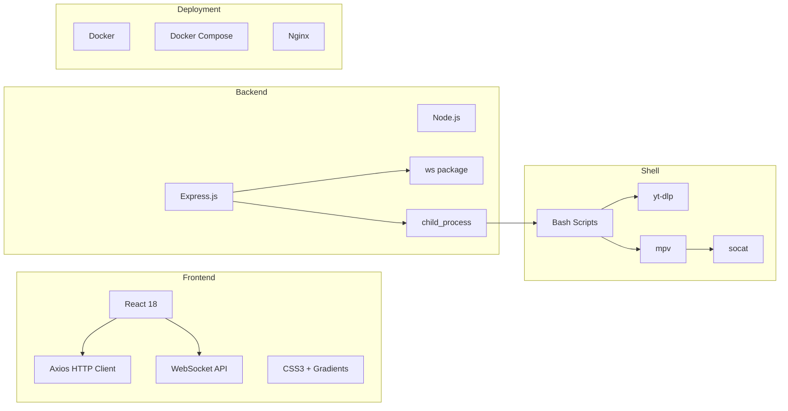
```mermaid
graph LR
    subgraph "Frontend"
        REACT[React 18]
        CSS[CSS3 + Gradients]
        AXIOS[Axios HTTP Client]
        WS_LIB[WebSocket API]
    end

    subgraph "Backend"
        NODE[Node.js]
        EXPRESS_FW[Express.js]
        WS_PKG[ws package]
        CHILD[child_process]
    end

    subgraph "Shell"
        BASH[Bash Scripts]
        YT[yt-dlp]
        MPV_PLAYER[mpv]
        SOCAT[socat]
    end

    subgraph "Deployment"
        DOCKER[Docker]
        COMPOSE[Docker Compose]
        NGINX[Nginx]
    end

    REACT --> AXIOS
    REACT --> WS_LIB
    EXPRESS_FW --> WS_PKG
    EXPRESS_FW --> CHILD
    CHILD --> BASH
    BASH --> YT
    BASH --> MPV_PLAYER
    MPV_PLAYER --> SOCAT
```

### Deployment Architecture

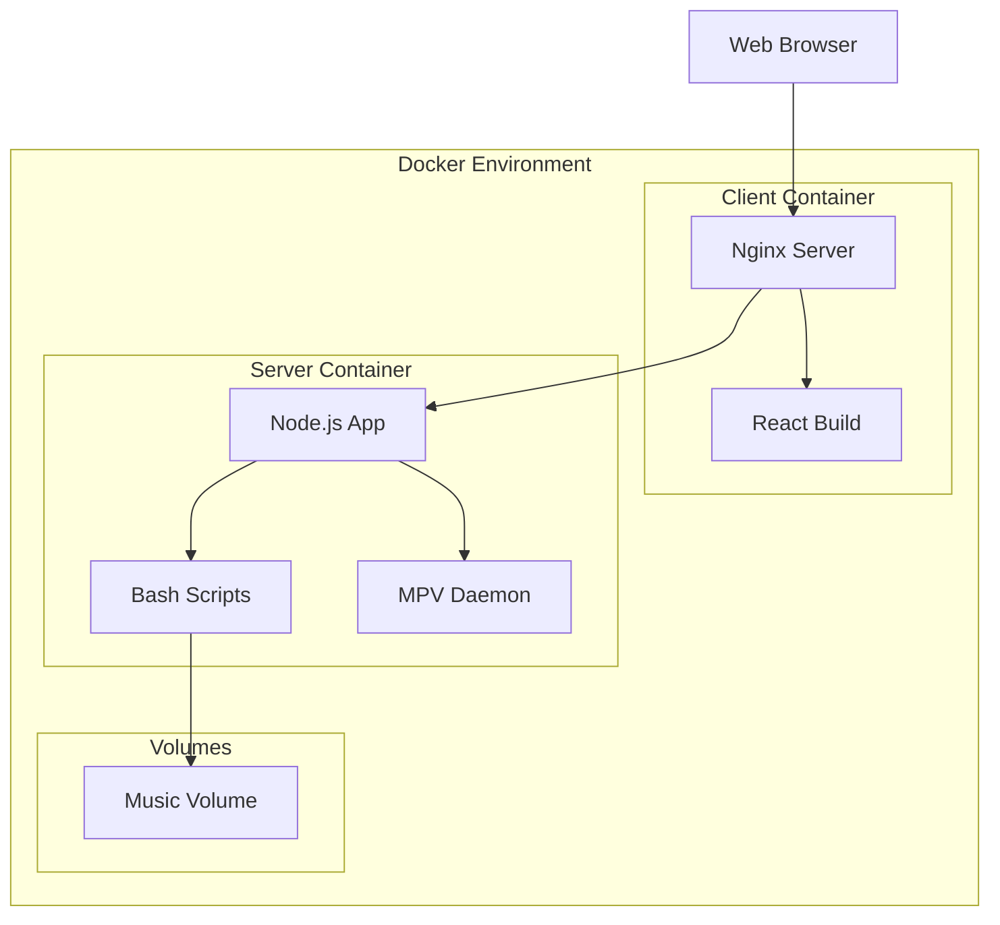
```mermaid
graph TB
    subgraph "Docker Environment"
        subgraph "Client Container"
            REACT_APP[React Build]
            NGINX_SERVER[Nginx Server]
        end

        subgraph "Server Container"
            NODE_APP[Node.js App]
            SCRIPTS[Bash Scripts]
            MPV_DAEMON[MPV Daemon]
        end

        subgraph "Volumes"
            MUSIC_VOL[Music Volume]
        end
    end

    BROWSER[Web Browser] --> NGINX_SERVER
    NGINX_SERVER --> REACT_APP
    NGINX_SERVER --> NODE_APP
    NODE_APP --> SCRIPTS
    NODE_APP --> MPV_DAEMON
    SCRIPTS --> MUSIC_VOL
```

---

## Low-Level Design (LLD)

### Frontend Component Structure

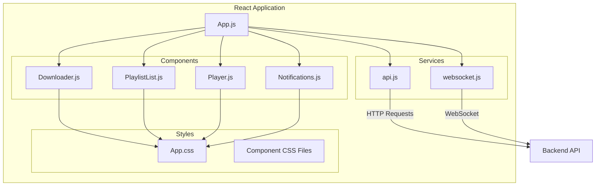
```mermaid
graph TB
    subgraph "React Application"
        APP[App.js]

        subgraph "Components"
            DOWNLOADER[Downloader.js]
            PLAYLIST[PlaylistList.js]
            PLAYER[Player.js]
            NOTIF[Notifications.js]
        end

        subgraph "Services"
            API_SVC[api.js]
            WS_SVC[websocket.js]
        end

        subgraph "Styles"
            APP_CSS[App.css]
            COMP_CSS[Component CSS Files]
        end
    end

    APP --> DOWNLOADER
    APP --> PLAYLIST
    APP --> PLAYER
    APP --> NOTIF
    APP --> API_SVC
    APP --> WS_SVC
    DOWNLOADER --> APP_CSS
    PLAYLIST --> APP_CSS
    PLAYER --> APP_CSS
    NOTIF --> APP_CSS
    API_SVC --> |HTTP Requests| BACKEND[Backend API]
    WS_SVC --> |WebSocket| BACKEND
```

### Backend API Structure

```mermaid
graph TB
    subgraph "Express Server"
        SERVER[server.js]

        subgraph "Routes"
            PLAYLIST_ROUTE[/api/playlists]
            TRACKS_ROUTE[/api/tracks]
            DOWNLOAD_ROUTE[/api/download]
            PLAYER_ROUTE[/api/player/:action]
            STATUS_ROUTE[/api/player/status]
            PLAY_PL_ROUTE[/api/playlist/play]
            INDEX_ROUTE[/api/index/rebuild]
            DAEMON_ROUTE[/api/daemon/start]
        end

        subgraph "Utils"
            EXECUTOR[executor.js]
        end

        subgraph "WebSocket"
            WS_HANDLER[WebSocket Handler]
            BROADCAST[Broadcast Function]
        end
    end

    SERVER --> PLAYLIST_ROUTE
    SERVER --> TRACKS_ROUTE
    SERVER --> DOWNLOAD_ROUTE
    SERVER --> PLAYER_ROUTE
    SERVER --> STATUS_ROUTE
    SERVER --> PLAY_PL_ROUTE
    SERVER --> INDEX_ROUTE
    SERVER --> DAEMON_ROUTE
    SERVER --> WS_HANDLER

    PLAYLIST_ROUTE --> EXECUTOR
    TRACKS_ROUTE --> EXECUTOR
    DOWNLOAD_ROUTE --> EXECUTOR
    PLAYER_ROUTE --> EXECUTOR
    STATUS_ROUTE --> EXECUTOR
    PLAY_PL_ROUTE --> EXECUTOR
    INDEX_ROUTE --> EXECUTOR
    DAEMON_ROUTE --> EXECUTOR

    EXECUTOR --> |spawn/exec| SHELL[Shell Scripts]
    WS_HANDLER --> BROADCAST
```

### Shell Command Executor

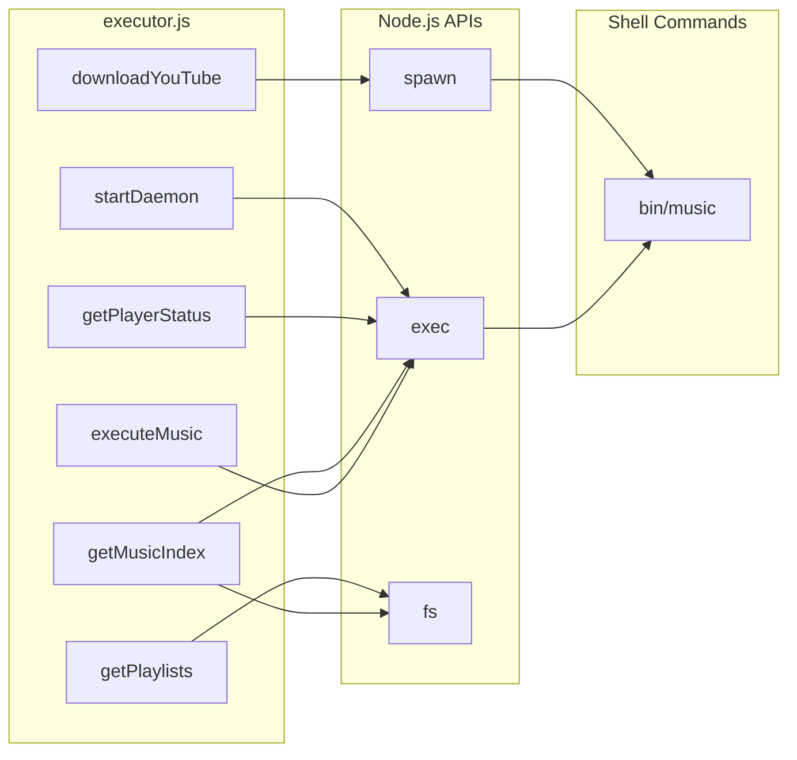
```mermaid
graph LR
    subgraph "executor.js"
        EXEC_FUNC[executeMusic]
        DL_FUNC[downloadYouTube]
        INDEX_FUNC[getMusicIndex]
        PLAYLIST_FUNC[getPlaylists]
        STATUS_FUNC[getPlayerStatus]
        DAEMON_FUNC[startDaemon]
    end

    subgraph "Node.js APIs"
        EXEC_API[exec]
        SPAWN_API[spawn]
        FS_API[fs]
    end

    subgraph "Shell Commands"
        MUSIC[bin/music]
    end

    EXEC_FUNC --> EXEC_API
    DL_FUNC --> SPAWN_API
    INDEX_FUNC --> EXEC_API
    INDEX_FUNC --> FS_API
    PLAYLIST_FUNC --> FS_API
    STATUS_FUNC --> EXEC_API
    DAEMON_FUNC --> EXEC_API

    EXEC_API --> MUSIC
    SPAWN_API --> MUSIC
```

### Data Models

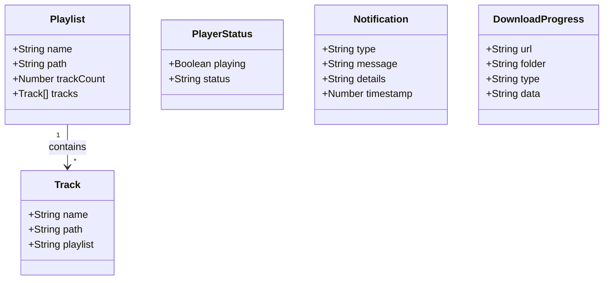
```mermaid
classDiagram
    class Playlist {
        +String name
        +String path
        +Number trackCount
        +Track[] tracks
    }

    class Track {
        +String name
        +String path
        +String playlist
    }

    class PlayerStatus {
        +Boolean playing
        +String status
    }

    class Notification {
        +String type
        +String message
        +String details
        +Number timestamp
    }

    class DownloadProgress {
        +String url
        +String folder
        +String type
        +String data
    }

    Playlist "1" --> "*" Track : contains
```

---

## Sequence Diagrams

### 1. Download YouTube Playlist

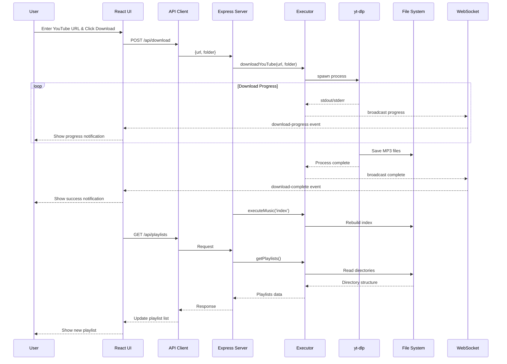
```mermaid
sequenceDiagram
    participant User
    participant React UI
    participant API Client
    participant Express Server
    participant Executor
    participant yt-dlp
    participant File System
    participant WebSocket

    User->>React UI: Enter YouTube URL & Click Download
    React UI->>API Client: POST /api/download
    API Client->>Express Server: {url, folder}
    Express Server->>Executor: downloadYouTube(url, folder)
    Executor->>yt-dlp: spawn process

    loop Download Progress
        yt-dlp-->>Executor: stdout/stderr
        Executor-->>WebSocket: broadcast progress
        WebSocket-->>React UI: download-progress event
        React UI-->>User: Show progress notification
    end

    yt-dlp->>File System: Save MP3 files
    yt-dlp-->>Executor: Process complete
    Executor-->>WebSocket: broadcast complete
    WebSocket-->>React UI: download-complete event
    React UI-->>User: Show success notification

    Express Server->>Executor: executeMusic('index')
    Executor->>File System: Rebuild index
    React UI->>API Client: GET /api/playlists
    API Client->>Express Server: Request
    Express Server->>Executor: getPlaylists()
    Executor->>File System: Read directories
    File System-->>Executor: Directory structure
    Executor-->>Express Server: Playlists data
    Express Server-->>API Client: Response
    API Client-->>React UI: Update playlist list
    React UI-->>User: Show new playlist
```

### 2. Play Music Track

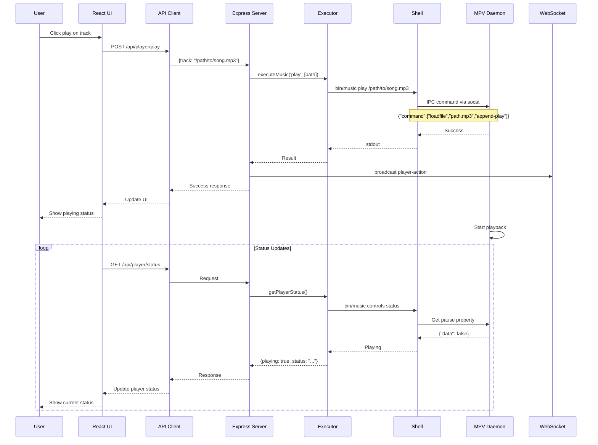
```mermaid
sequenceDiagram
    participant User
    participant React UI
    participant API Client
    participant Express Server
    participant Executor
    participant Shell
    participant MPV Daemon
    participant WebSocket

    User->>React UI: Click play on track
    React UI->>API Client: POST /api/player/play
    API Client->>Express Server: {track: "/path/to/song.mp3"}
    Express Server->>Executor: executeMusic('play', [path])
    Executor->>Shell: bin/music play /path/to/song.mp3
    Shell->>MPV Daemon: IPC command via socat
    Note over Shell,MPV Daemon: {"command":["loadfile","path.mp3","append-play"]}
    MPV Daemon-->>Shell: Success
    Shell-->>Executor: stdout
    Executor-->>Express Server: Result
    Express Server->>WebSocket: broadcast player-action
    Express Server-->>API Client: Success response
    API Client-->>React UI: Update UI
    React UI-->>User: Show playing status

    MPV Daemon->>MPV Daemon: Start playback

    loop Status Updates
        React UI->>API Client: GET /api/player/status
        API Client->>Express Server: Request
        Express Server->>Executor: getPlayerStatus()
        Executor->>Shell: bin/music controls status
        Shell->>MPV Daemon: Get pause property
        MPV Daemon-->>Shell: {"data": false}
        Shell-->>Executor: Playing
        Executor-->>Express Server: {playing: true, status: "..."}
        Express Server-->>API Client: Response
        API Client-->>React UI: Update player status
        React UI-->>User: Show current status
    end
```

### 3. Player Controls (Pause/Next/Volume)

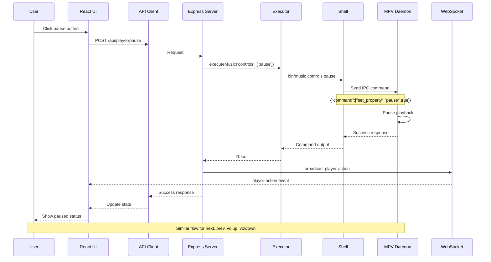
```mermaid
sequenceDiagram
    participant User
    participant React UI
    participant API Client
    participant Express Server
    participant Executor
    participant Shell
    participant MPV Daemon
    participant WebSocket

    User->>React UI: Click pause button
    React UI->>API Client: POST /api/player/pause
    API Client->>Express Server: Request
    Express Server->>Executor: executeMusic('controls', ['pause'])
    Executor->>Shell: bin/music controls pause
    Shell->>MPV Daemon: Send IPC command
    Note over Shell,MPV Daemon: {"command":["set_property","pause",true]}
    MPV Daemon->>MPV Daemon: Pause playback
    MPV Daemon-->>Shell: Success response
    Shell-->>Executor: Command output
    Executor-->>Express Server: Result

    Express Server->>WebSocket: broadcast player-action
    WebSocket-->>React UI: player-action event

    Express Server-->>API Client: Success response
    API Client-->>React UI: Update state
    React UI-->>User: Show paused status

    Note over User,MPV Daemon: Similar flow for next, prev, volup, voldown
```

### 4. Browse Playlists

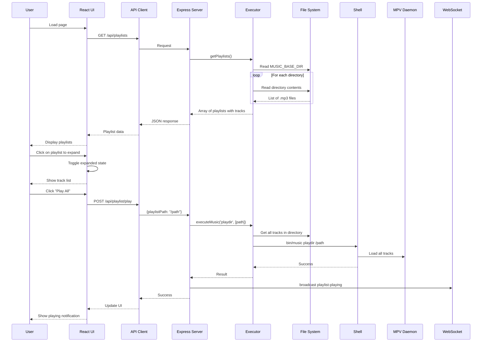
```mermaid
sequenceDiagram
    participant User
    participant React UI
    participant API Client
    participant Express Server
    participant Executor
    participant File System

    User->>React UI: Load page
    React UI->>API Client: GET /api/playlists
    API Client->>Express Server: Request
    Express Server->>Executor: getPlaylists()
    Executor->>File System: Read MUSIC_BASE_DIR

    loop For each directory
        Executor->>File System: Read directory contents
        File System-->>Executor: List of .mp3 files
    end

    Executor-->>Express Server: Array of playlists with tracks
    Express Server-->>API Client: JSON response
    API Client-->>React UI: Playlist data
    React UI-->>User: Display playlists

    User->>React UI: Click on playlist to expand
    React UI->>React UI: Toggle expanded state
    React UI-->>User: Show track list

    User->>React UI: Click "Play All"
    React UI->>API Client: POST /api/playlist/play
    API Client->>Express Server: {playlistPath: "/path"}
    Express Server->>Executor: executeMusic('playdir', [path])
    Executor->>File System: Get all tracks in directory
    Executor->>Shell: bin/music playdir /path
    Shell->>MPV Daemon: Load all tracks
    Shell-->>Executor: Success
    Executor-->>Express Server: Result
    Express Server->>WebSocket: broadcast playlist-playing
    Express Server-->>API Client: Success
    API Client-->>React UI: Update UI
    React UI-->>User: Show playing notification
```

### 5. Rebuild Index

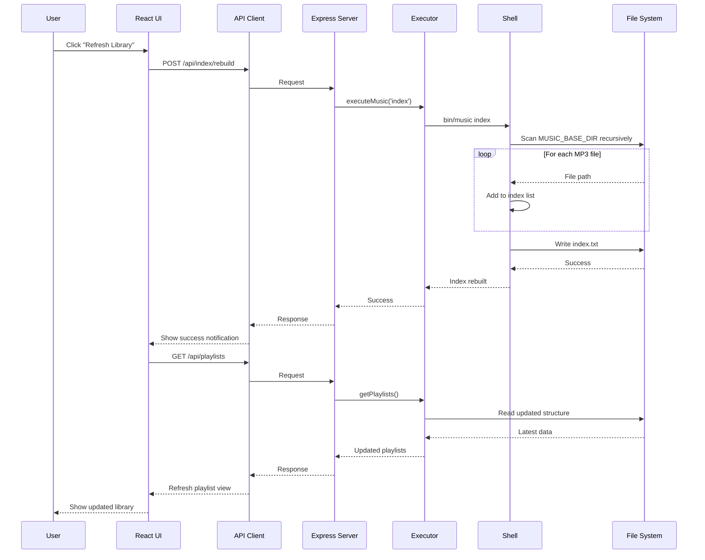
```mermaid
sequenceDiagram
    participant User
    participant React UI
    participant API Client
    participant Express Server
    participant Executor
    participant Shell
    participant File System

    User->>React UI: Click "Refresh Library"
    React UI->>API Client: POST /api/index/rebuild
    API Client->>Express Server: Request
    Express Server->>Executor: executeMusic('index')
    Executor->>Shell: bin/music index
    Shell->>File System: Scan MUSIC_BASE_DIR recursively

    loop For each MP3 file
        File System-->>Shell: File path
        Shell->>Shell: Add to index list
    end

    Shell->>File System: Write index.txt
    File System-->>Shell: Success
    Shell-->>Executor: Index rebuilt
    Executor-->>Express Server: Success
    Express Server-->>API Client: Response
    API Client-->>React UI: Show success notification

    React UI->>API Client: GET /api/playlists
    API Client->>Express Server: Request
    Express Server->>Executor: getPlaylists()
    Executor->>File System: Read updated structure
    File System-->>Executor: Latest data
    Executor-->>Express Server: Updated playlists
    Express Server-->>API Client: Response
    API Client-->>React UI: Refresh playlist view
    React UI-->>User: Show updated library
```

### 6. WebSocket Real-Time Updates

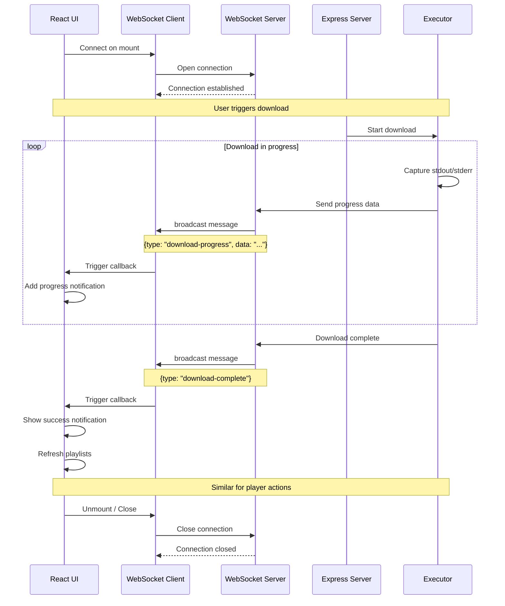
```mermaid
sequenceDiagram
    participant React UI
    participant WebSocket Client
    participant WebSocket Server
    participant Express Server
    participant Executor

    React UI->>WebSocket Client: Connect on mount
    WebSocket Client->>WebSocket Server: Open connection
    WebSocket Server-->>WebSocket Client: Connection established

    Note over React UI,Executor: User triggers download

    Express Server->>Executor: Start download

    loop Download in progress
        Executor->>Executor: Capture stdout/stderr
        Executor->>WebSocket Server: Send progress data
        WebSocket Server->>WebSocket Client: broadcast message
        Note over WebSocket Server,WebSocket Client: {type: "download-progress", data: "..."}
        WebSocket Client->>React UI: Trigger callback
        React UI->>React UI: Add progress notification
    end

    Executor->>WebSocket Server: Download complete
    WebSocket Server->>WebSocket Client: broadcast message
    Note over WebSocket Server,WebSocket Client: {type: "download-complete"}
    WebSocket Client->>React UI: Trigger callback
    React UI->>React UI: Show success notification
    React UI->>React UI: Refresh playlists

    Note over React UI,Executor: Similar for player actions

    React UI->>WebSocket Client: Unmount / Close
    WebSocket Client->>WebSocket Server: Close connection
    WebSocket Server-->>WebSocket Client: Connection closed
```

### 7. Start MPV Daemon

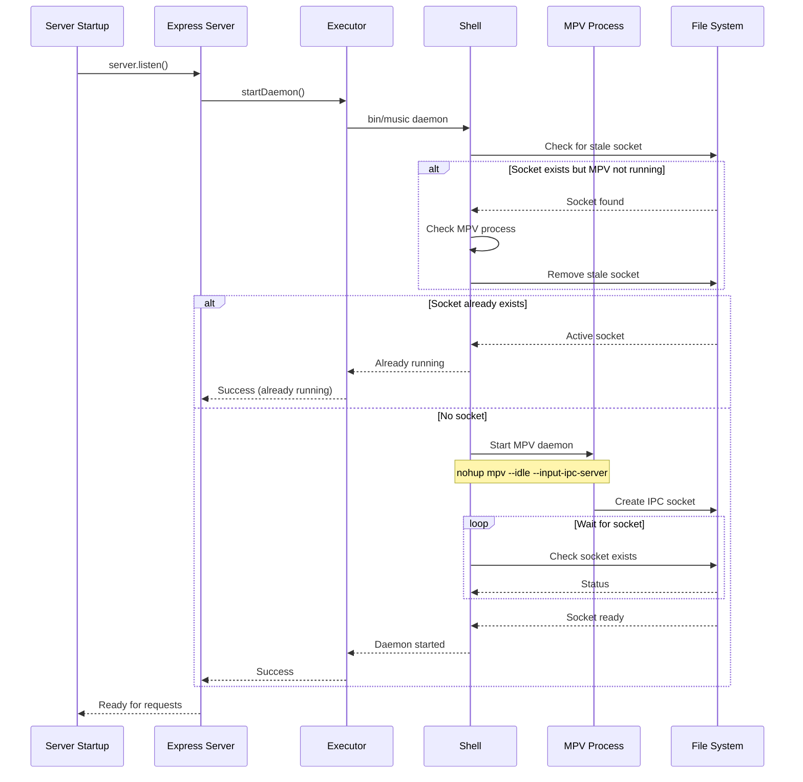
```mermaid
sequenceDiagram
    participant Server Startup
    participant Express Server
    participant Executor
    participant Shell
    participant MPV Process
    participant File System

    Server Startup->>Express Server: server.listen()
    Express Server->>Executor: startDaemon()
    Executor->>Shell: bin/music daemon
    Shell->>File System: Check for stale socket

    alt Socket exists but MPV not running
        File System-->>Shell: Socket found
        Shell->>Shell: Check MPV process
        Shell->>File System: Remove stale socket
    end

    alt Socket already exists
        File System-->>Shell: Active socket
        Shell-->>Executor: Already running
        Executor-->>Express Server: Success (already running)
    else No socket
        Shell->>MPV Process: Start MPV daemon
        Note over Shell,MPV Process: nohup mpv --idle --input-ipc-server
        MPV Process->>File System: Create IPC socket

        loop Wait for socket
            Shell->>File System: Check socket exists
            File System-->>Shell: Status
        end

        File System-->>Shell: Socket ready
        Shell-->>Executor: Daemon started
        Executor-->>Express Server: Success
    end

    Express Server-->>Server Startup: Ready for requests
```

---

## Data Flow

### Request/Response Flow

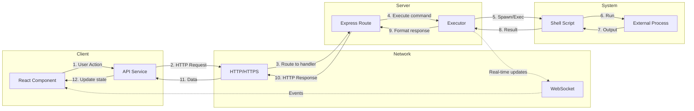
```mermaid
graph LR
    subgraph "Client"
        UI[React Component]
        API[API Service]
    end

    subgraph "Network"
        HTTP[HTTP/HTTPS]
        WS[WebSocket]
    end

    subgraph "Server"
        ROUTE[Express Route]
        EXEC[Executor]
    end

    subgraph "System"
        SHELL[Shell Script]
        PROC[External Process]
    end

    UI -->|1. User Action| API
    API -->|2. HTTP Request| HTTP
    HTTP -->|3. Route to handler| ROUTE
    ROUTE -->|4. Execute command| EXEC
    EXEC -->|5. Spawn/Exec| SHELL
    SHELL -->|6. Run| PROC
    PROC -->|7. Output| SHELL
    SHELL -->|8. Result| EXEC
    EXEC -->|9. Format response| ROUTE
    ROUTE -->|10. HTTP Response| HTTP
    HTTP -->|11. Data| API
    API -->|12. Update state| UI

    EXEC -.->|Real-time updates| WS
    WS -.->|Events| UI
```

### File System Data Flow

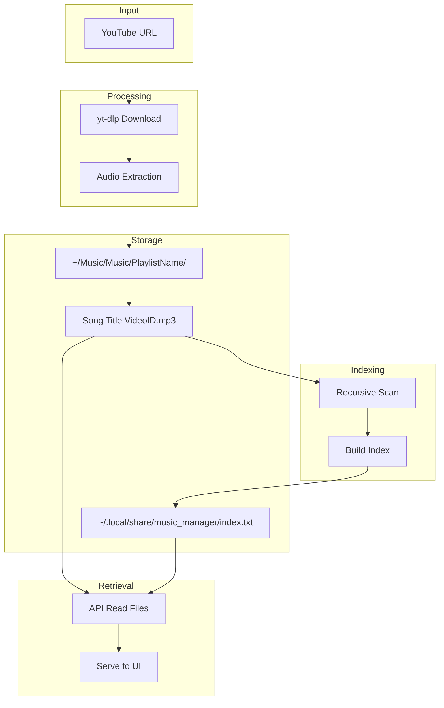
```mermaid
graph TB
    subgraph "Input"
        YT_URL[YouTube URL]
    end

    subgraph "Processing"
        YT_DLP[yt-dlp Download]
        CONVERT[Audio Extraction]
    end

    subgraph "Storage"
        MUSIC_DIR[~/Music/Music/PlaylistName/]
        MP3[Song Title VideoID.mp3]
        INDEX[~/.local/share/music_manager/index.txt]
    end

    subgraph "Indexing"
        SCAN[Recursive Scan]
        BUILD[Build Index]
    end

    subgraph "Retrieval"
        API_READ[API Read Files]
        SERVE[Serve to UI]
    end

    YT_URL --> YT_DLP
    YT_DLP --> CONVERT
    CONVERT --> MUSIC_DIR
    MUSIC_DIR --> MP3

    MP3 --> SCAN
    SCAN --> BUILD
    BUILD --> INDEX

    MP3 --> API_READ
    INDEX --> API_READ
    API_READ --> SERVE
```

---

## Component Architecture

### React Component Hierarchy

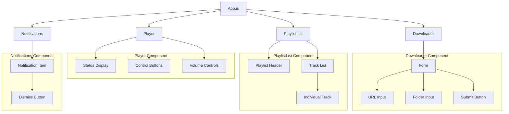
```mermaid
graph TB
    APP[App.js]

    APP --> DOWNLOADER[Downloader]
    APP --> PLAYER[Player]
    APP --> PLAYLIST[PlaylistList]
    APP --> NOTIF[Notifications]

    subgraph "Downloader Component"
        D_FORM[Form]
        D_INPUT1[URL Input]
        D_INPUT2[Folder Input]
        D_BUTTON[Submit Button]
    end

    subgraph "Player Component"
        P_STATUS[Status Display]
        P_CONTROLS[Control Buttons]
        P_VOLUME[Volume Controls]
    end

    subgraph "PlaylistList Component"
        PL_HEADER[Playlist Header]
        PL_TRACKS[Track List]
        PL_ITEM[Individual Track]
    end

    subgraph "Notifications Component"
        N_ITEM[Notification Item]
        N_DISMISS[Dismiss Button]
    end

    DOWNLOADER --> D_FORM
    D_FORM --> D_INPUT1
    D_FORM --> D_INPUT2
    D_FORM --> D_BUTTON

    PLAYER --> P_STATUS
    PLAYER --> P_CONTROLS
    PLAYER --> P_VOLUME

    PLAYLIST --> PL_HEADER
    PLAYLIST --> PL_TRACKS
    PL_TRACKS --> PL_ITEM

    NOTIF --> N_ITEM
    N_ITEM --> N_DISMISS
```

### State Management

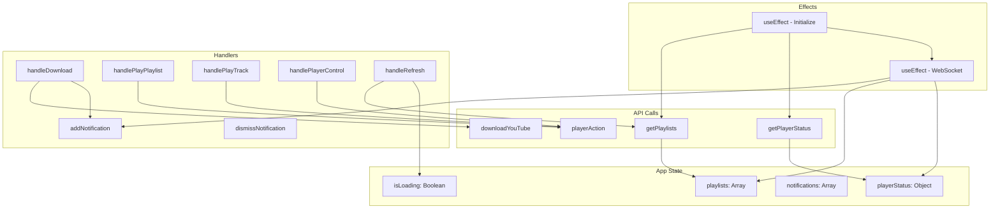
```mermaid
graph TB
    subgraph "App State"
        PLAYLISTS[playlists: Array]
        PLAYER_STATUS[playerStatus: Object]
        NOTIFICATIONS[notifications: Array]
        LOADING[isLoading: Boolean]
    end

    subgraph "Effects"
        INIT[useEffect - Initialize]
        WS_CONNECT[useEffect - WebSocket]
    end

    subgraph "Handlers"
        H_DOWNLOAD[handleDownload]
        H_PLAY_PL[handlePlayPlaylist]
        H_PLAY_TRACK[handlePlayTrack]
        H_CONTROL[handlePlayerControl]
        H_REFRESH[handleRefresh]
        ADD_NOTIF[addNotification]
        DISMISS_NOTIF[dismissNotification]
    end

    subgraph "API Calls"
        GET_PL[getPlaylists]
        GET_STATUS[getPlayerStatus]
        POST_DL[downloadYouTube]
        POST_PLAY[playerAction]
    end

    INIT --> GET_PL
    INIT --> GET_STATUS
    INIT --> WS_CONNECT

    GET_PL --> PLAYLISTS
    GET_STATUS --> PLAYER_STATUS

    H_DOWNLOAD --> POST_DL
    H_DOWNLOAD --> ADD_NOTIF

    H_PLAY_PL --> POST_PLAY
    H_PLAY_TRACK --> POST_PLAY
    H_CONTROL --> POST_PLAY

    H_REFRESH --> GET_PL
    H_REFRESH --> LOADING

    WS_CONNECT --> ADD_NOTIF
    WS_CONNECT --> PLAYLISTS
    WS_CONNECT --> PLAYER_STATUS
```

---

## API Endpoints Reference

### Complete API Map

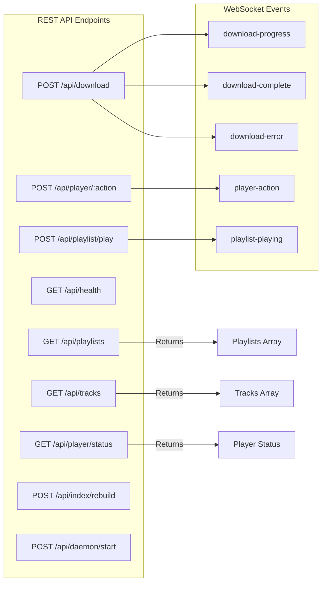
```mermaid
graph LR
    subgraph "REST API Endpoints"
        GET_PL[GET /api/playlists]
        GET_TR[GET /api/tracks]
        GET_ST[GET /api/player/status]
        GET_HE[GET /api/health]

        POST_DL[POST /api/download]
        POST_PL[POST /api/player/:action]
        POST_PP[POST /api/playlist/play]
        POST_IX[POST /api/index/rebuild]
        POST_DA[POST /api/daemon/start]
    end

    subgraph "WebSocket Events"
        WS_PROG[download-progress]
        WS_COMP[download-complete]
        WS_ERR[download-error]
        WS_PLAY[player-action]
        WS_PL[playlist-playing]
    end

    GET_PL --> |Returns| PL_DATA[Playlists Array]
    GET_TR --> |Returns| TR_DATA[Tracks Array]
    GET_ST --> |Returns| ST_DATA[Player Status]

    POST_DL --> WS_PROG
    POST_DL --> WS_COMP
    POST_DL --> WS_ERR

    POST_PL --> WS_PLAY
    POST_PP --> WS_PL
```

---

## Deployment Flow

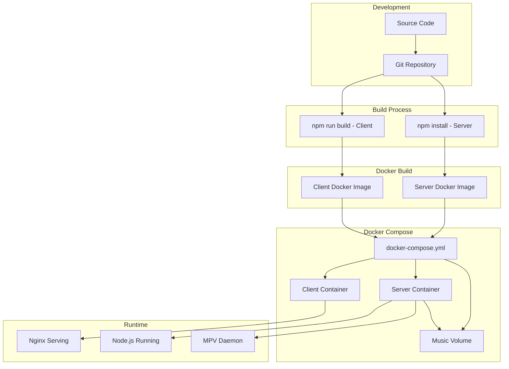
```mermaid
graph TB
    subgraph "Development"
        CODE[Source Code]
        GIT[Git Repository]
    end

    subgraph "Build Process"
        CLIENT_BUILD[npm run build - Client]
        SERVER_PKG[npm install - Server]
    end

    subgraph "Docker Build"
        CLIENT_IMG[Client Docker Image]
        SERVER_IMG[Server Docker Image]
    end

    subgraph "Docker Compose"
        COMPOSE[docker-compose.yml]
        CLIENT_CONT[Client Container]
        SERVER_CONT[Server Container]
        VOLUME[Music Volume]
    end

    subgraph "Runtime"
        NGINX_RUN[Nginx Serving]
        NODE_RUN[Node.js Running]
        MPV_RUN[MPV Daemon]
    end

    CODE --> GIT
    GIT --> CLIENT_BUILD
    GIT --> SERVER_PKG

    CLIENT_BUILD --> CLIENT_IMG
    SERVER_PKG --> SERVER_IMG

    CLIENT_IMG --> COMPOSE
    SERVER_IMG --> COMPOSE

    COMPOSE --> CLIENT_CONT
    COMPOSE --> SERVER_CONT
    COMPOSE --> VOLUME

    CLIENT_CONT --> NGINX_RUN
    SERVER_CONT --> NODE_RUN
    SERVER_CONT --> MPV_RUN

    SERVER_CONT --> VOLUME
```

---

## Security Considerations

```mermaid
graph TB
    subgraph "Security Layers"
        CORS[CORS Configuration]
        INPUT[Input Validation]
        CMD[Command Injection Prevention]
        FILE[File Path Validation]
    end

    subgraph "Best Practices"
        ENV[Environment Variables]
        ESCAPE[Shell Escaping]
        LIMIT[Rate Limiting - Future]
        AUTH[Authentication - Future]
    end

    CORS --> |Restricts| ORIGIN[Allowed Origins]
    INPUT --> |Validates| URL[YouTube URLs]
    CMD --> |Prevents| INJECT[Malicious Commands]
    FILE --> |Sanitizes| PATHS[File Paths]

    ENV --> |Protects| SECRETS[Sensitive Data]
    ESCAPE --> |Escapes| SHELL[Shell Arguments]
```

---

## Performance Optimization

```mermaid
graph LR
    subgraph "Frontend Optimizations"
        LAZY[Lazy Loading]
        MEMO[React Memoization]
        DEBOUNCE[Debounced Updates]
    end

    subgraph "Backend Optimizations"
        ASYNC[Async Operations]
        STREAM[Streaming Responses]
        CACHE[File System Cache]
    end

    subgraph "Network Optimizations"
        WS_REUSE[WebSocket Connection Reuse]
        GZIP[Compression - Future]
        CDN[CDN - Future]
    end

    LAZY --> |Reduces| BUNDLE[Bundle Size]
    MEMO --> |Prevents| RERENDER[Unnecessary Renders]
    DEBOUNCE --> |Reduces| API_CALLS[API Calls]

    ASYNC --> |Improves| THROUGHPUT[Throughput]
    STREAM --> |Enables| REALTIME[Real-time Updates]
    CACHE --> |Speeds up| FS_OPS[File Operations]

    WS_REUSE --> |Reduces| OVERHEAD[Connection Overhead]
```

---

This design documentation provides a comprehensive overview of the YouTube Downloader & Player architecture, component interactions, and data flows. Use these diagrams as a reference for understanding, extending, or maintaining the application.
